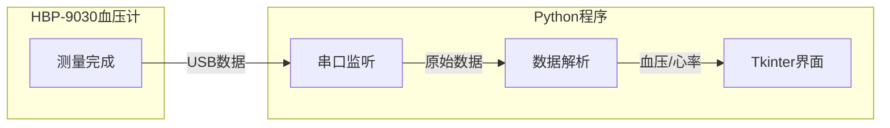

# HBP-9030 血压计数据读取程序

## 架构设计




## 主要功能模块

### 1. 串口通信模块

- 使用 `pyserial` 库进行串口通信
- 自动扫描可用COM端口供用户选择
- 支持常见波特率配置（默认9600）
- 后台线程持续监听，测量完成后立即接收数据

### 2. 数据解析模块

- 支持解析HBP-9030的多种传输格式
- 提取关键数据：收缩压(SYS)、舒张压(DIA)、脉搏率(PR)、测量时间
- 原始数据日志功能，便于调试和格式适配

### 3. Tkinter图形界面

- 显示当前连接状态和端口信息
- 大字体醒目显示：收缩压、舒张压、心率
- 测量历史记录列表
- 连接/断开按钮
- 实时状态指示器

## 界面设计示意

```javascript
+------------------------------------------+
|        OMRON HBP-9030 血压监测            |
+------------------------------------------+
|  端口: [COM3 v]  [连接]  状态: ● 已连接   |
+------------------------------------------+
|                                          |
|     收缩压          舒张压         心率   |
|      120            80            72     |
|     mmHg           mmHg          bpm     |
|                                          |
+------------------------------------------+
|  历史记录                                 |
|  2026-01-20 14:30  120/80  72 bpm       |
|  2026-01-20 14:25  118/78  70 bpm       |
+------------------------------------------+
```


## 文件结构

```javascript
OMRON/
  bp_monitor.py       # 主程序（包含所有功能）
  requirements.txt    # 依赖包
```


## 依赖

- Python 3.7+
- pyserial（串口通信）
- tkinter（Python内置，无需额外安装）

## 使用步骤

1. 安装依赖：`pip install pyserial`
2. 将HBP-9030通过USB连接到电脑
3. 在设备管理器中确认COM端口号
4. 运行程序，选择对应端口并点击连接
5. 在血压计上进行测量，完成后数据自动显示

## 注意事项